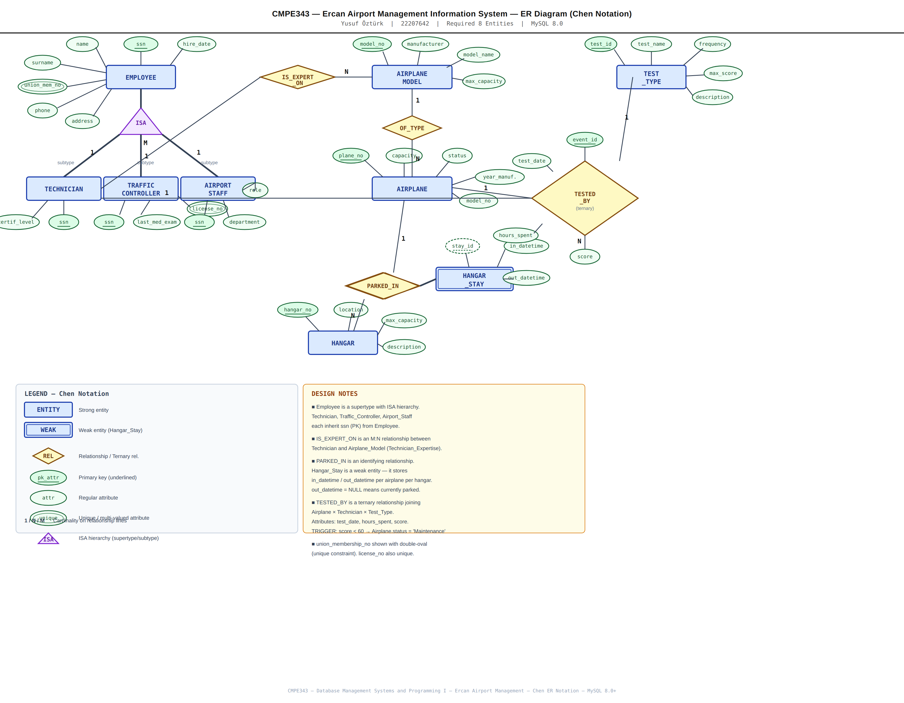

# CMPE343 – Database Management Systems and Programming I
## Term Project Report: Ercan Airport Management Information System

**Student:** Yusuf Öztürk  
**Student No:** 22207642  
**Due Date:** 24/05/2026  
**Database:** MySQL 8.0+

---

## 1. Introduction

This project designs and implements a Relational Database Management System (RDBMS) for **Ercan Airport (ECN), North Cyprus**. The system stores, manages and retrieves all airport-related information including airplane inventory, hangar usage, employee records, periodic airworthiness testing, flights and fuel records.

### System Overview

The database supports the following operational areas:

- **Airplane & Model Management** — individual aircraft records linked to standardized model data
- **Hangar Assignment History** — time-stamped IN/OUT tracking of aircraft in hangars
- **Employee Management** — three employee subtypes: Technicians, Traffic Controllers, Airport Staff
- **Technician Expertise** — many-to-many relationship between technicians and airplane models
- **Airworthiness Testing** — recording each test event (who, what plane, what test, score, hours)
- **Flight Operations** — flight records linked to aircraft, controllers, and runways
- **Fuel Management** — fuel refueling records per aircraft

### Design Assumptions

1. Each employee is uniquely identified by their **Social Security Number (SSN)**.
2. `Employee` uses a **supertype/subtype (ISA)** pattern — one base table, three subtype tables sharing the same primary key.
3. An airplane may appear in multiple hangar records over time. `out_datetime IS NULL` means the airplane is currently in that hangar.
4. Hangar capacity (`max_capacity`) is stored for reporting; overbooking prevention is enforced at the application layer.
5. A technician may test any airplane regardless of expertise; **Query 13** identifies such cross-model test events for audit purposes.
6. Traffic controllers must have an annual medical exam. The DB stores the date; **Query 4** reports overdue controllers.
7. All union membership numbers are unique across employees.
8. Test scores are integers (0–100). A score below 60 automatically triggers an airplane status change to `Maintenance` via a database trigger.
9. `Airplane_Model` is normalized separately from `Airplane` to avoid repeating manufacturer/capacity data and to enable the M:N technician expertise relationship.

---

## 2. ER Diagram



> **Notation:** Chen ER Notation — rectangles = entities, ellipses = attributes (underlined = PK), diamonds = relationships, ISA triangle = supertype/subtype hierarchy, double rectangle = weak entity, double diamond = identifying relationship.

### Entities (15 tables)

| Table | Type | Description |
|-------|------|-------------|
| `Employee` | Supertype | All airport workers |
| `Technician` | Subtype | Aircraft maintenance staff |
| `Traffic_Controller` | Subtype | Air traffic controllers |
| `Airport_Staff` | Subtype | Other airport personnel |
| `Technician_Expertise` | Junction (M:N) | Technician ↔ Airplane Model |
| `Airplane_Model` | Master | Aircraft model catalog |
| `Airplane` | Entity | Individual aircraft |
| `Hangar` | Entity | Physical hangar bays |
| `Hangar_Stay` | Weak Entity | Airplane ↔ Hangar with IN/OUT timestamps |
| `Test_Type` | Master | Airworthiness test catalog |
| `Testing_Event` | Transaction | Each individual test instance (ternary) |
| `Runway` | Entity | Airport runways |
| `Flight` | Transaction | Flight records |
| `Fuel_Record` | Transaction | Fuel refueling records |
| `Audit_Log` | System | Trigger-generated audit trail |

### Key Relationships

| Relationship | Cardinality | Notes |
|---|---|---|
| Employee → Technician | 1:0..1 | ISA subtype |
| Employee → Traffic_Controller | 1:0..1 | ISA subtype |
| Employee → Airport_Staff | 1:0..1 | ISA subtype |
| Technician ↔ Airplane_Model | M:N | via Technician_Expertise |
| Airplane ↔ Hangar | M:N | via Hangar_Stay (with timestamps) |
| Airplane, Technician, Test_Type → Testing_Event | ternary | one event = one plane + one tech + one test |
| Airplane → Flight | 1:N | |
| Traffic_Controller → Flight | 1:N | |
| Runway → Flight | 1:N | |
| Airport_Staff → Fuel_Record | 1:N | |

---

## 3. Relational Data Model

```
Employee(ssn PK, name, surname, union_membership_no UNIQUE, phone, address, hire_date)

Technician(ssn PK FK→Employee.ssn, certification_level)

Traffic_Controller(ssn PK FK→Employee.ssn, last_medical_exam, license_no UNIQUE)

Airport_Staff(ssn PK FK→Employee.ssn, department, role)

Airplane_Model(model_no PK, manufacturer, model_name, max_capacity)

Technician_Expertise(tech_ssn PK FK→Technician.ssn,
                     model_no  PK FK→Airplane_Model.model_no)

Airplane(plane_no PK, model_no FK→Airplane_Model.model_no,
         capacity, status, year_manufactured)

Hangar(hangar_no PK, location, max_capacity, description)

Hangar_Stay(stay_id PK AUTO, plane_no FK→Airplane.plane_no,
            hangar_no FK→Hangar.hangar_no, in_datetime, out_datetime)

Test_Type(test_id PK, test_name, description, max_score, frequency)

Testing_Event(event_id PK AUTO, plane_no FK→Airplane.plane_no,
              tech_ssn FK→Technician.ssn, test_id FK→Test_Type.test_id,
              test_date, hours_spent, score)

Runway(runway_id PK, length_m, width_m, surface, status)

Flight(flight_id PK, plane_no FK→Airplane.plane_no,
       controller_ssn FK→Traffic_Controller.ssn,
       runway_id FK→Runway.runway_id,
       origin, destination, scheduled_dep, actual_dep,
       scheduled_arr, actual_arr, flight_status)

Fuel_Record(fuel_id PK AUTO, plane_no FK→Airplane.plane_no,
            staff_ssn FK→Airport_Staff.ssn,
            fuel_date, fuel_type, liters, cost_usd)

Audit_Log(log_id PK AUTO, event_time, table_name, action, description)
```

---

## 4. DDL Summary

**File:** `01_DDL.sql`

All tables include appropriate constraints:

| Constraint Type | Examples |
|---|---|
| `PRIMARY KEY` | All tables |
| `FOREIGN KEY` with `ON UPDATE CASCADE` | All relationships |
| `ON DELETE CASCADE` | Employee subtypes |
| `UNIQUE` | `union_membership_no`, `license_no` |
| `CHECK` | `capacity > 0`, `score >= 0`, `hours_spent > 0`, `out_datetime > in_datetime` |
| `ENUM` | `status`, `certification_level`, `frequency`, `fuel_type`, `surface` |
| `AUTO_INCREMENT` | `stay_id`, `event_id`, `fuel_id`, `log_id` |
| `DEFAULT` | `status = 'Active'`, `max_score = 100` |

### Views (3)
- `vw_hangar_occupancy` — real-time hangar capacity view
- `vw_employee_roster` — all employees with their subtype label
- `vw_airplane_health` — test statistics per airplane

### Triggers (3)
- `trg_low_score_maintenance` — score < 60 → airplane status set to `Maintenance`
- `trg_check_stay_dates` — prevents `out_datetime <= in_datetime`
- `trg_audit_test_event` — logs every new testing event to `Audit_Log`

### Stored Procedures (3)
- `sp_airplane_test_history(plane_no)` — full test history for an airplane
- `sp_hangar_checkin(plane_no, hangar_no, datetime)` — check airplane into hangar
- `sp_hangar_checkout(stay_id, datetime)` — check airplane out of hangar

---

## 5. DML Summary

**File:** `02_DML.sql`

| Table | Rows Inserted |
|---|---|
| Airplane_Model | 8 |
| Employee | 12 |
| Technician | 5 |
| Traffic_Controller | 3 |
| Airport_Staff | 4 |
| Technician_Expertise | 12 |
| Airplane | 10 |
| Hangar | 5 |
| Hangar_Stay | 12 |
| Test_Type | 8 |
| Testing_Event | 20 |
| Runway | 3 |
| Flight | 6 |
| Fuel_Record | 6 |

Also includes: 3 `UPDATE` examples, 1 `DELETE` example (commented).

---

## 6. Query Summary

**File:** `03_Queries.sql`

| # | Query Description | Key Techniques |
|---|---|---|
| Q1 | All airplanes with model info | `INNER JOIN` |
| Q2 | Test count & score stats per airplane | `LEFT JOIN`, `GROUP BY`, `AVG/MIN/MAX` |
| Q3 | Technicians expert in ≥2 models | `GROUP BY`, `HAVING` |
| Q4 | Overdue medical exam controllers | `DATE_SUB`, `DATEDIFF` |
| Q5 | Hangar occupancy with fill percentage | `LEFT JOIN`, `IS NULL`, `GROUP BY` |
| Q6 | Pass/fail rate per test type | `CASE WHEN`, `GROUP BY` |
| Q7 | Top 5 productive technicians | `SUM`, `ORDER BY`, `LIMIT` |
| Q8 | Airplanes never tested | `NOT IN` subquery |
| Q9 | Monthly test activity | `DATE_FORMAT`, `GROUP BY` |
| Q10 | Airplanes below average score | Subquery in `HAVING` |
| Q11 | Full hangar history with durations | `DATEDIFF`, `COALESCE`, `CASE` |
| Q12 | Employee roster with role type | `CASE`, multiple `LEFT JOIN` |
| Q13 | Tests by non-expert technicians (audit) | `NOT EXISTS` correlated subquery |
| Q14 | Top 3 hangars by plane-days stored | `SUM(DATEDIFF)`, `LIMIT` |
| Q15 | Airplane health & fuel cost report | Derived subquery (FROM), `COALESCE`, `CASE` |

---

## 7. How to Run

### Requirements
- MySQL 8.0 or higher
- MySQL client or MySQL Workbench

### Steps

```bash
# Step 1 — Create schema, tables, views, triggers, procedures
mysql -u root -p < 01_DDL.sql

# Step 2 — Insert all sample data
mysql -u root -p < 02_DML.sql

# Step 3 — Run management queries
mysql -u root -p airport_mgmt < 03_Queries.sql
```

Or to run a specific query interactively:
```sql
USE airport_mgmt;
CALL sp_airplane_test_history('TC-NCE01');
SELECT * FROM vw_hangar_occupancy;
SELECT * FROM vw_airplane_health;
```

---

## 8. GitHub Repository

All project files are published at: **https://github.com/yusufozturkdev-sudo/ercan-airport-db**

```
Repository structure:
├── 01_DDL.sql        → Schema: 15 tables, 3 views, 3 triggers, 3 stored procedures
├── 02_DML.sql        → Sample data + UPDATE/DELETE examples
├── 03_Queries.sql    → 15 management queries
├── 04_Report.md      → This report
├── ERD_Chen.png      → ER Diagram (Chen Notation)
└── README.md         → Setup instructions
```
